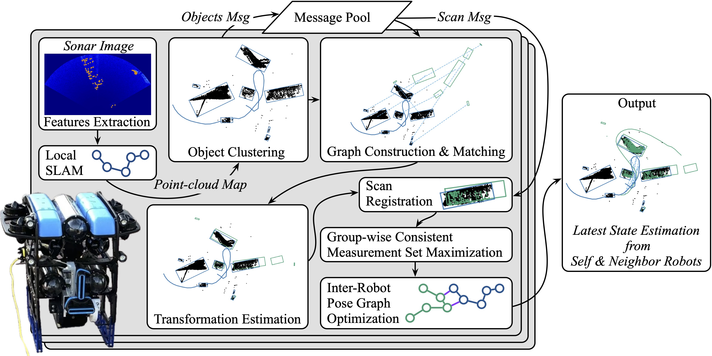

# DRACO-SLAM2
**This repository accompanies the paper *[DRACo-SLAM2: Distributed Robust Acoustic Communication-efficient SLAM for Imaging Sonar Equipped Underwater Robot Teams with Object Graph Matching]()* (IROS 2025).**

**DRACo-SLAM2** is a distributed SLAM framework for underwater robot teams equipped with imaging sonar. 
This framework improves upon the original [DRACo-SLAM](https://github.com/jake3991/DRACo-SLAM) by introducing a novel representation of sonar maps as object graphs and utilizing object graph matching to achieve time-efficient inter-robot loop closure detection without relying on prior geometric information. 
To better-accommodate the needs and characteristics of underwater scan matching, we propose incremental Group-wise Consistent Measurement Set Maximization (GCM), a modification of Pairwise Consistent Measurement Set Maximization (PCM), which effectively handles scenarios where nearby inter-robot loop closures share similar registration errors.
<p align="center"></p>

- **Overview of DRACo-SLAM2 Architecture:**
  - Each robot’s object map is clustered using  to group . 
  - The local robot:
    - Groups nearby feature points into an object map using **DBSCAN**.
    - Receives a neighboring robot’s object map. 
    - Aligns the received map with its own via graph matching. 
    - Requests raw scans from the neighbor for ICP registration, using the graph matching transformation as an initial guess. 
    - Adds inter-robot loop closures to the pose graph. 
    - A two-step pose graph optimization (PGO) is performed to refine the global estimate.
  - The multi-robot component is currently **decoupled** from the single-robot SLAM system. We encourage you to integrate the multi-robot code with your own single-robot SLAM front-end — any implementation is welcome and appreciated.
```
  ├──DRACO2
     ├── config                     # Parameters fpr DRACO1 & DRACO2
     ├── SLAM                       # Both DRACO1 & DRACO2 SLAM code
     ├── scripts
     │   └── run_mission.py         # Multi-robot SLAM example
     ├── data                       # Folder for the dataset
     └── ...
  ```
<p align="center"></p>

 - **Example DRACo-SLAM2 result with real sonar data** collected at the U.S. Merchant Marine Academy, King’s Point, NY, aligned with a satellite image.

## Dependencies
- [BRUCE-SLAM](https://github.com/jake3991/sonar-SLAM)
- We provide there example [datasets](https://huggingface.co/datasets/yeweihuang/DRACO2_Datasets).
## How to use

```
cd FOLDER_BRUCE_SLAM
source /opt/ros/noetic/setup.sh
source devel/setup.sh
python FOLDER_DRACO2/scripts/run_mission.py -b PATH_TO_BAG -p PATH_TO_PICKLE -y config/param.yaml -o PATH_TO_OUTPUT
# bag file not needed for real-world example in our case
```

